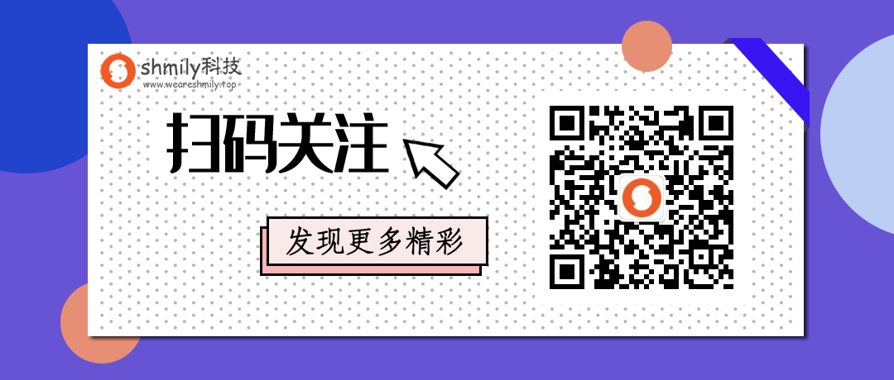
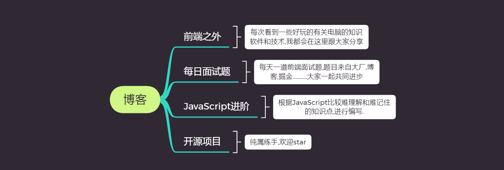

# 博客目录
致力于打造能够帮助前端程序员提高的文章，欢迎关注**我的公众号：weshmily前端，不定时更新前端文章带你进入前端的魅力世界**  

### 版权声明：本文为博主原创文章，未经博主允许不得转载。
- [官方网站(资源网站)](https://weareshmily.top)
- [GitHub(全部文章)](https://github.com/weshmily/Blog)
- [CSDN(全部文章)](https://blog.csdn.net/qq_27118895)
- [掘金博客(全部文章)](https://juejin.im/user/5bf50726e51d450cb4186756)
- [segmentFault博客(正在同步文章)](https://segmentfault.com/u/weshmilyqd)

 欢迎关注公众号：**weshmily前端**，你的成长我们一起见证！	

 

### 版块介绍(陆续开放)

 

### |  [JavaScript进阶](https://github.com/weshmily/Blog/issues?q=is%3Aopen+is%3Aissue+project%3Aweshmily%2FBlog%2F1)
#### 1.[JavaScript进阶之’this‘](https://github.com/weshmily/Blog/issues/1)
#### 2.[JavaScript进阶之' 原型和原型链 '](https://github.com/weshmily/Blog/issues/2)
#### 3.[JavaScript进阶之' Object.defineProperty( ) '](https://github.com/weshmily/Blog/issues/3)

### |  [每日面试题](https://github.com/weshmily/Blog/issues?q=is%3Aopen+is%3Aissue+project%3Aweshmily%2FBlog%2F3)

### |  [前端之外](https://github.com/weshmily/Blog/issues?q=is%3Aopen+is%3Aissue+project%3Aweshmily%2FBlog%2F4)
#### 1.[esp8266无线干扰器工具包+固件(仅用于测试使用)](https://github.com/weshmily/esp8266)

### |  [开源项目](https://github.com/weshmily/Blog/issues?q=is%3Aopen+is%3Aissue+project%3Aweshmily%2FBlog%2F2)
#### 1.[MockServe接口模拟工具](https://github.com/weshmily/mockserve)
#### 2.[cesium地球三维展示平台](https://github.com/weshmily/earth-3d-cloud)

### |  打赏
如果你感觉有收获，欢迎给我打赏,以激励我更多输出优质开源内容!

### | 领取红包

每天可以都可以领取一次哟!!
